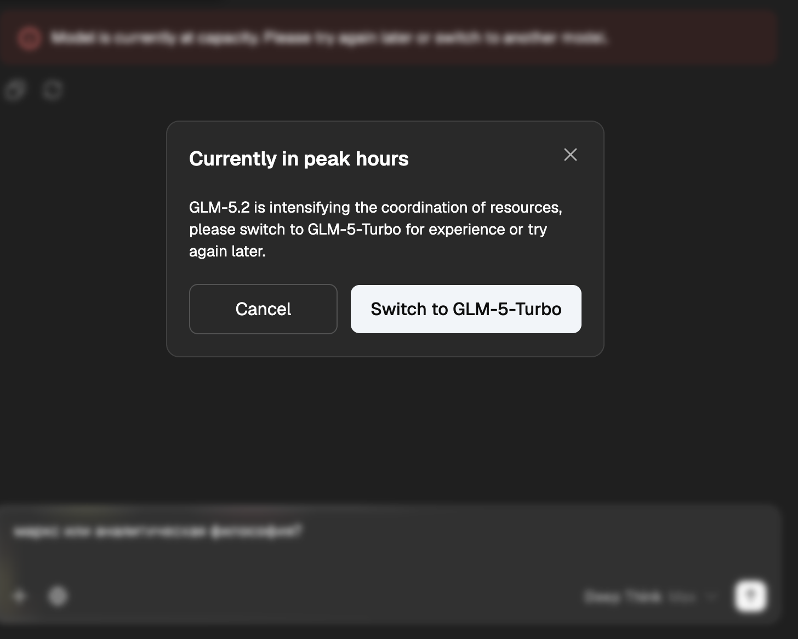

# Z.ai Auto Retry

A small Chrome extension that automatically retries a Z.ai chat request when the service shows the **"Currently in peak hours"** dialog.

When Z.ai is overloaded, a retry a few seconds later is often enough to get a normal response. This extension watches for the peak-hours modal, saves the current prompt and pending file uploads, reloads the chat, restores the prompt, re-uploads files when possible, and sends the message again.

## Features

- Detects the Z.ai peak-hours modal automatically.
- Saves the current message before retrying.
- Preserves pending file uploads and re-uploads them after reload when possible.
- Reloads the chat and sends the saved message again.
- Simple ON/OFF toggle by clicking the extension icon.
- Badge shows the current state: `ON` or `OFF`.

## Installation

1. Open `chrome://extensions/` in Chrome or another Chromium-based browser.
2. Enable **Developer mode**.
3. Click **Load unpacked**.
4. Select this project folder.
5. Open `https://chat.z.ai/`.
6. Click the extension icon to turn auto retry `ON`.

## How it works

The extension runs only on `https://chat.z.ai/*`. It observes the page for the peak-hours dialog. When the dialog appears, it stores the current input state in Chrome local storage, cancels the failed request, reloads the page, restores the saved prompt, and clicks the send button again.

For file uploads, the extension temporarily stores file data and the current authorization header in Chrome local storage so it can re-upload files after the page reloads.

## Privacy and security

This extension does not send data to any third-party server. All temporary retry data is stored locally in Chrome storage and is removed after retry initialization.

Because file retry support needs to re-upload files to Z.ai, the extension may temporarily store uploaded file contents and an authorization header locally in the browser. Use it only on your own trusted browser profile.

## Permissions

- `storage` — stores retry state between reloads.
- `https://chat.z.ai/*` — runs only on the Z.ai chat website.

## License

MIT
